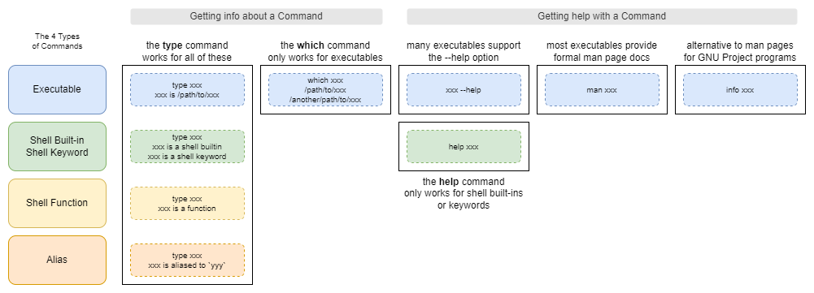

# Bash Scripting Guide

- Version: 0.0.1
- Author:
  - Nathan Nellans
  - Email: me@nathannellans.com
  - Web:
    - https://www.nathannellans.com
    - https://github.com/nnellans/bash-guide

> [!IMPORTANT]
> This is an advanced guide and assumes you already know the basics of Bash.  Think of this more like an advanced cheat sheet.  I went through various sources, captured any notes that I felt were important, and organized them into the README file you see here.

> [!WARNING]
> This is a live document.  Some of the sections are still a work in progress.  I will be continually updating it over time.

> [!TIP]
> Google's [Shell Style Guide](https://google.github.io/styleguide/shellguide.html) has many great recommendations and best practices that I also agree with.  When you see me use `GSG:` that means the following recommendation will be coming from Google's Style Guide.

---

# Table of Contents
- [Script File Basics](#script-file-basics)
- [Commands](#commands)
- [Variables](#variables)
  - [Shell Variables](#shell-variables)
  - [Environment Variables](#environment-variables)
- [Shell Functions](#shell-functions)
  - [Local Variables](#local-variables)
- [Aliases](#aliases)
- [Standard Input, Output, and Error](#standard-input-output-and-error)

---
# Script File Basics

Bash scripts are just text files. While they don't require a file extension, it's common for them to use the `.sh` file extension.

### Comments
Comments start with the `#` symbol

```shell
# this is a comment

echo "something" # comments can be after a command, as long as you have at least one space before the #
```

> GSG: Don't comment everything. Comment tricky, non-obvious, interesting or important parts of your code.

### Shebang
All bash scripts should start with a shebang line at the top.  It tells the kernel which interpreter to use when running the script.

Standard example:
- `#!/bin/bash`
- This may not work in 100% of cases, as some systems place `bash` in a different location other than `/bin`

Portable (somewhat) version:
- `#!/usr/bin/env bash`
- For portability reasons, it is commonly recommended to use a shebang like this
- This version will run the first `bash` found in your `$PATH` variable
- This also may not work for 100% of cases, as some systems place `env` in a different location other than `/usr/bin`

### Setting shell options

The `set` command can be used to configure the shell.  Some common options are:
- `set -x` enables debug mode, where commands and arguments are printed out as they are executed
- `set -e` exits the script immediately if any command returns a non-zero exit status
- `set -u` exits the script immediately if you try to use a variable that's undefined
- `set -o pipefail`
  - When piping commands together (`command1 | command2`) Bash will only return the exit status of the last command
  - This `set` option tells Bash to return a non-zero exit status if ANY of the commands in the pipeline fail
- Bash lets you combine short parameters together, so you can set all options at once with : `set -xeuo pipefail`

---

# Commands

There are multiple types of commands you can run within bash:
1. Executables (like binaries and scripts)
2. Shell built-ins and keywords
3. Shell functions
4. Aliases

I created the graphic below to highlight how you can get information & help on the 4 types of commands:



You can put more than 1 command on a single line by separating them with semicolons:

```shell
echo "this"; echo "that"; echo "up"; echo "down"
```

You can extend a single command over multiple lines for better readability using backslashes:

```shell
ls --no-group \
  --inode \
  --reverse \
  --recursive \
  --size
```

> GSG: You should try to keep your lines to 80 characters max

You can send the output from command1 to the input of command2 using a pipe

```shell
command1 | command2
```

> GSG: If you can fit a whole pipeline on 1 line, then do it. If not, then use multiple lines and put each segment on its own line:
>
> ```shell
> command1 \
>   | command2 \
>   | command3
> ```

Bash supports a couple of logical command operators for specifying AND and OR logic:

```shell
# run command1 and, only if its successful, then run command2
command1 && command2

# run command1 and, only if it fails, then run command2
command1 || command2
```

For better readability in scripts, consider using the long form of parameters, when available:

```shell
du --all --human-readable  # use this
du -ah                     # instead of this
```

---

# Variables

Variables in bash come in a couple of different flavors

### Shell Variables

Shell variables are only available to the particular shell session or script in which they are created.

Naming conventions:
- May contain letters, numbers, and underscores
- Must not start with a number
- Names are case-sensitive, so `varname` is different than `VarName`

> GSG:
> - Shell variables should use all lowercase letters, with underscores to separate words
> - Constant variables (read-only) should use all uppercase letters, with underscores to separate words

Defining Shell variables:

```shell
# you can define a shell variable by simply assigning a value to it
# there must be no spaces between the end of the variable name, the equals sign, and the start of the value
variable_name="Some value"

# you can define multiple variables on the same line
var1="value1" var2="value2" var3="value3"

# another method is to use the declare command
declare var_name="value"
declare -r var_name="value" # the -r marks this variable as read-only (constant)
declare -i var_name=34527   # the -i marks this variable with the 'integer' attribute
declare -a var_name         # the -a declares an indexed array
declare -A var_name         # the -A declares an associative array

# yet another way to mark a variable as readonly
readonly var_name="value"
```

> GSG: For sake of clarity use `readonly` instead of `declare -r`

Using Shell variables:

```shell
# you can use a variable by preceding it with a $ symbol
echo "$var_name"

# optionally, you can add curly braces to the name
# this is necessary if you have to do string concatenation
echo "${var_name}plusSomeMoreText"
```

> GSG:
> - Always double-quote strings containing variables
> - Prefer `${var_name}` over `$var_name`, except:
>   - Don't use braces for special variables like `$@` or `$!`, unless strictly necessary
>   - Don't use braces for the first 10 positional parameters like `$0` and `$6`

Assigning temporary values to variables:

```shell
# you can assign values to variables in the same line that you run a command
# these assignments take effect only for the duration of the specified command
var1="value1" var2="value2" command
```

### Environment Variables

Just like Shell variables, Environment variables can be used in the current shell session.  However, Environment variables also have the benefit of being usable in any child shells or processes that are created.

Environment variables use the same naming standards as Shell variables

> GSG: Environment variables should use all uppercase letters, with underscores to separate words

Defining Environment variables:

```shell
# method 1: first assign a value to a Shell variable, and then 'export' it into an Environment variable
VAR_NAME="some value"
export VAR_NAME

# method 2: use the export command to create an Environment variable and assign a value at the same time
export VAR_NAME="some value"

# method 3: you can also use the declare command to create an Environment variable
declare -x VAR_NAME="some value" # the -x tells declare to 'export' this variable
```

> GSG: For sake of clarity use `export` instead of `declare -x`

Using Environment variables:

Environment variables are used the same way Shell variables are used.

# Shell Functions

Shell Functions allow you to define reusable blocks of code.

Defining Shell Functions:

> [!IMPORTANT]  
> In your code, you must define your functions first before you can call them

Environment variables use the same naming standards as Shell variables

```shell
# method 1: this is the most compatible method
name_of_function() {
  command1
  command2
  return #optional
}

# method 2
function name_of_function {
  command1
  command2
  return #optional
}
```

> GSG:
> - The opening `{` must be on the same line as the function name
> - No space between the function name and `()`

The `return` command is optional and is not required.
- By default, a Shell function will return the exit code from the last command it runs
- However, if you would like your function to return a specific exit code, then you can use `return` followed by a number.  For example, `return 1` would make your function return an exit code of 1

Using (calling) Shell functions:

```shell
# treat a shell function just like any command and call it by name
command1
command2
function_name
```

Use Positional Parameters to pass arguments to a Shell function:<br />*(Positional Parameters will be discussed in more detail later)*

```shell
# defining the function
function_name() {
  echo "$1"
  echo "$2"
  echo "$3"
}

# calling the function
function_name "arg1" "arg2" "arg3"
```

### Local Variables

You can define and use Local variables inside your functions.
- Local variables are visible only to the function where they are defined, and its children
- The names of Local variables will not conflict with other global variables defined elsewhere
  - This helps you to create portable functions
 
Defining and using Local variables in a function:

```shell
# method 1: using the local command. this is the preferred method
function_name() {
  local var_name="Albert"
  echo "You can call me ${var_name}"
}

# method 2: using the declare command
# when used inside of a function, declare will create local variables by default
function_name() {
  declare var_name="Albert"
  echo "You can call me ${var_name}"
}
```

> GSG: Do not use local to create a variable and give it a value from command substitution in the same line. The  `local` command does not propagate the exit code from the command substitution.
> ```shell
> # bad example
> local var_name="$(someCommand)" # this will return the exit code from local, not the command substitution
>
> # correct way
> local var_name
> var_name="$(someCommand)"
> ```

# Aliases

When you think of Aliases you should think of "nicknames".  You can create an Alias to represent a complicated command, or set of commands.  For example, if you were a Kubernetes admin you might run the following command often:  `kubectl get pods --namespace default --out wide`.  You could create an alias for this called `kgp`. After that, you can simply run `kgp` instead of that long command.

> GSG: Aliases should be avoided in scripts. For almost every purpose, shell functions are preferred over aliases.

```shell
# define an alias
alias name_of_alias='commands;commands;commands'

# remove an alias
unalias name_of_alias

# use an alias
command1
command2
alias_name
```

# Viewing Variables, Functions, and Aliases

There are multiple commands to view all of the Shell variables, Environment variables, Functions, and Aliases that are currently defined in your environment. Below, you'll see a graphic I created that shows some of those commands, and what information each one will return.


---

# Standard Input, Output, and Error

| Stream | Purpose | Default | File Descriptor |
| --- | --- | --- | --- |
| `stdin` | Feed data into a command | keyboard | `0` |
| `stdout` | Output data from a command | screen | `1` |
| `stderr` | Output errors from a comamnd | screen | `2` |

### Redirecting Standard Input

```shell
# method 1: run command1 first and "pipe" its output into command2's standard input
command1 | command2

# method 2: take the contents of file.txt and feed it into command1's standard input
command1 < file.txt

# method 3a: Here Document: feed a whole body of text into command1's standard input
# the "token" should not be found anywhere else in the given body of text
# it is common to use the following token:  _EOF_
command1 << token
line of text
another line of text
last line for now
token

# method 3b: using <<- instead of << lets you indent a Here Document for better readability
# only tab characters are supported (not spaces), be careful with how your text editor treats tabs vs. spaces
command1 <<- token
    indented line of text
    another line of text
    last line for now
token

# method 4: Here String: feed a single line of text into command1's standard input
command1 <<< "line of text"
```

### Redirecting Standard Output

```shell
# write stdout to a file
command > file.txt  # overwrite
command >> file.txt # append

# redirect stdout to stderr
command 1>&2  # full form
command >&2   # stdout (file descriptor 1) is assumed, so the 1 can be omitted

# suppress stdout by redirecting to /dev/null
command > /dev/null
```

### Redirecting Standard Error

```shell
# write stderr to a file
command 2> file.txt  # overwrite
command 2>> file.txt # append

# suppress stderr by redirecting to /dev/null
command 2> /dev/null
```

### Redirecting stdout & stderr to the same file

```shell
# method 1: the traditional & most compatible way
# this statement contains 2 redirections, and they must be in this order
# first, redirect stdout to a file
# second, redirect stderr to stdout
command > file.txt 2>&1

# method 2: streamlined method that works in newer versions of Bash
command &> file.txt  # overwrite
command &>> file.txt # append
```

---

# If Statements

```shell
if conditional; then
  commands
elif conditional; then
  commands
else
  commands
fi
```

> GSG: Put `; then` at the end of the same line that contains `if` or `elif`

- `conditional` can be any command, or set of commands, that will return an exit code
  - Bash handles true or false differently from most programming languages, it treats true as `0` and false as not `0`
- `elif` and `else` are optional, only use them if you need to
- There are multiple ways to write your conditional expression. Three of those ways will be explored below

### Conditional 1: the `test` and `[ … ]` commands

The `test` command comes in 2 different forms:

```shell
# less common form
test expression

# widely used form
[ expression ]
```

`test` supports a few logical operators for its expressions:

```shell
[ ! expression1 ]               # expression1 does NOT succeed
[ expression1 -a expression2 ]  # both expression1 AND expression2 succeeds
[ expression1 -o expression2 ]  # either expression1 OR expression2 succeeds
```

`test` has many different types of tests. I will highlight some of them below. This is by no means an exhaustive list.

```shell
# file-based expressions
[ -e file_name ]        # the given file exists
[ -f file_name ]        # the given file exists as a regular file
[ -d dir_name ]         # the given file exists as a directory

# string-based expressions
[ string ]              # the given string's length is greater than 0
[ -n string ]           # same as above. this is the preferred form
[ -z string ]           # the given string's length is 0
[ string1 = string2 ]   # string1 is equal to string2. don't use this form, as it can be confused with assignment
[ string1 == string2 ]  # same as above. this is the preferred form
[ string1 != string2 ]  # string1 is not equal to string2

# integer-based expressions
[ int1 -eq int2 ]       # int1 is equal to int2
[ int1 -ne int2 ]       # int1 is not equal to int2
[ int1 -gt int2 ]       # int1 is greater than int2
[ int1 -ge int2 ]       # int1 is greater than or equal to int2
[ int1 -lt int2 ]       # int1 is less than int2
[ int1 -le int2 ]       # int1 is less than or equal to int2
```

### Conditional 2: the `[[ … ]]` commands

`[[ … ]]` is the enhanced replacement for `test`.

> GSG:
> - `[[ … ]]` is preferred over `test` and `[ … ]`
> - For preference, don’t use `[[ … ]]` at all for numeric comparisons, use `(( … ))` instead.

`[[ … ]]` supports everything that `test` supports, with a few notable changes and additions:

Changes to logical operators:

```shell
# for AND, instead of using -a use &&
[[ command1 && command2 ]]

# for OR, instead of using -o use ||
[[ command1 || command2 ]]
```

Newly added expressions:

```shell
# test if a string matches a regular expression
[[ string =~ regexPattern ]]

# test if a string matches (or not) a pattern
# uses the same pattern syntax as pathname expansion
[[ string == "foo*" ]]
[[ string != "bar*" ]]
```

### Conditional 3: the `(( … ))` commands

`(( … ))` only supports arithmetic expressions.

> GSG: Always use `(( … ))` rather than `let` or `expr`

`(( … ))` supports a few logical operators for its expressions:

```shell
(( ! expression1 ))               # expression1 does NOT succeed
(( expression1 && expression2 ))  # both expression1 AND expression2 succeeds
(( expression1 || expression2 ))  # either expression1 OR expression2 succeeds
```

`(( … ))` also supports a ternary conditional operator

```shell
# test expression1 first. if successful, THEN test expression2. ELSE if it fails, then test expression3
# will return the exit status from expression2 or 3 (whichever one gets tested)
(( expression1 ? expression2 : expression3 ))
```

`(( … ))` supports many types of arithmetic expressions. The following is NOT an exhaustive list.

```shell
# comparison expressions
(( int1 == int2 ))          # equal to
(( int1 != int2 ))          # not equal to
(( int1 < int2 ))           # less than
(( int1 <= int2 ))          # less than or equal to
(( int1 > int2 ))           # greater than
(( int1 >= int2 ))          # greater than or equal to

# arithmetic expressions. these examples all use ==, but any comparison operator above is supported
(( int1 + int2 == int3 ))   # addition
(( int1 - int2 == int3 ))   # subtraction
(( int1 * int2 == int3 ))   # multiplication
(( int1 / int2 == int3 ))   # division
(( int1 % int2 == int3 ))   # remainder / modulo
(( int1 ** int2 == int3 ))  # exponentiation / power of
```

> GSG: Be careful of running `(( … ))` standalone. If an expression evaluates to `0`, like `(( 5 - 5 ))`, then the exit code will actually be `1`. This exit status can be considered failure, and might cause your script to exit.
